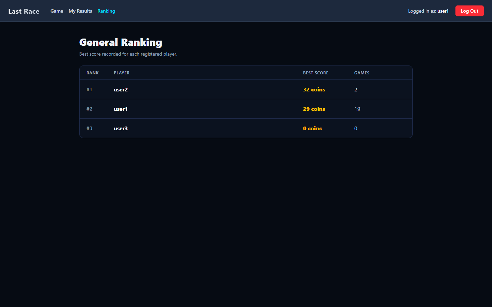
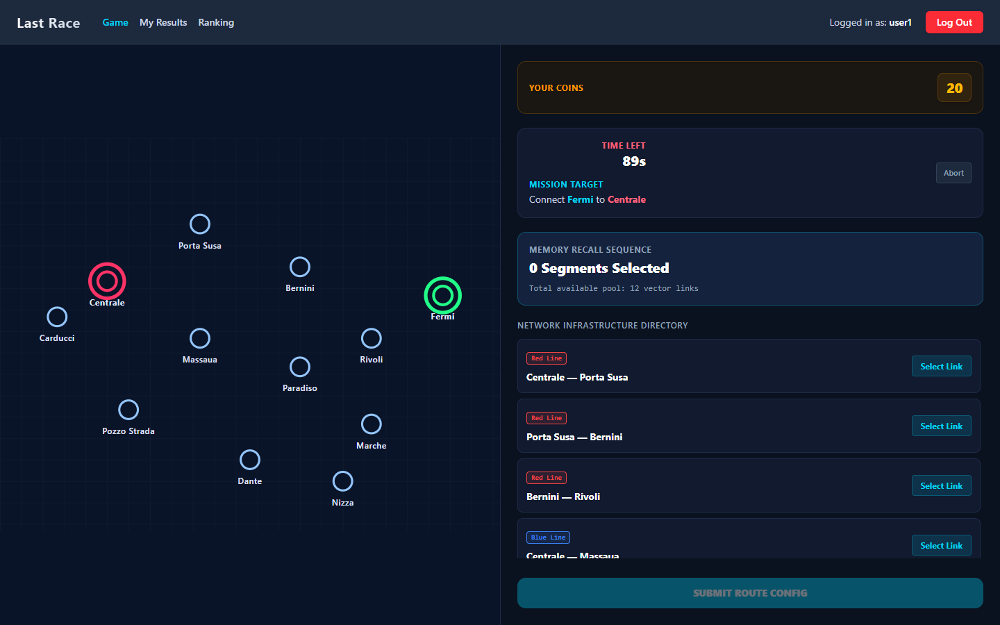

# Exam #1: "Last Race"
## Student: s353422 SAMARXHIU ARION

## React Client Application Routes

- Route `/`: public instructions and login form. Anonymous visitors can read the rules but cannot see the network map or play.
- Route `/app`: authenticated game page with setup, planning, execution, and result phases.
- Route `/history`: authenticated page showing the logged user's completed games ordered by score.
- Route `/ranking`: authenticated general ranking page showing each registered player's best score.

## API Server

- POST `/api/sessions`
  - Login endpoint. Receives credentials in the request body as `{ email, password }`, verifies the salted password hash with Passport/session login, and creates the session cookie.
  - Response body: logged user `{ id, username, email }`; returns `401` if credentials are invalid.
- GET `/api/sessions/current-user`
  - Session-check endpoint used by client loaders and navigation. It reads the current session cookie and returns the logged user if the session is valid.
  - Response body: `{ id, username, email }`, or `401` if not authenticated.
- DELETE `/api/sessions/delete`
  - Logout endpoint. It calls Passport logout, destroys the server-side session, and clears the session cookie.
  - Response body: confirmation message `{ message }`.
- GET `/api/map`
  - Authenticated endpoint. Returns the fixed underground network needed by the client to draw the map and segment list; random events are not sent to the client.
  - Response body: `{ stations, segments, lines }`.
- GET `/api/games/challenge`
  - Authenticated endpoint. Creates a server-side active race and returns `{ startStation, endStation, startTime }`.
  - The server randomly chooses a destination reachable from the start with a minimum distance of at least 3 segments.
- POST `/api/games/submit`
  - Authenticated endpoint. Validates the selected route against the server-side active race stored in the session.
  - Request body: `{ routeSegmentIds }`, where the array contains selected segment IDs in order.
  - Response body: `{ success, isValid, finalScore, executionSteps, reason, message }`.
  - If the route is invalid, incomplete, duplicated, or late, the game is stored with score 0. If valid, the server applies random events and stores the final score.
- GET `/api/games/history`
  - Authenticated endpoint. Returns only the logged user's completed games, ordered by score descending.
  - Response body: `{ id, score }[]`.
- GET `/api/games/ranking`
  - Authenticated endpoint. Returns the general ranking, with one row for each registered user and the best score among their games.
  - Response body: `{ userId, username, bestScore, gamesPlayed }[]`, ordered by best score descending.

## Database Tables

- Table `users` - registered users with unique username/email and salted password hash.
  - Columns: `id`, `username`, `email`, `hash`, `salt`.
- Table `games` - completed game scores associated with registered users.
  - Columns: `id`, `user_id`, `score`.
- Table `stations` - fixed station names and map coordinates.
  - Columns: `id`, `name`, `x`, `y`.
- Table `lines` - metro line names and colors.
  - Columns: `id`, `name`, `color`.
- Table `segments` - station-to-station connections, each belonging to one line.
  - Columns: `id`, `line_id`, `start_station`, `end_station`.
- Table `events` - random journey events with a description and coin effect.
  - Columns: `id`, `description`, `effect`.

## Main React Components

- `App` (in `App.jsx`): main authenticated game flow and phase state.
- `LoginPage` (in `pages/Login.jsx`): public instructions and login form.
- `GameHistory` (in `pages/GameHistory.jsx`): personal game history page.
- `Ranking` (in `pages/Ranking.jsx`): general ranking page.
- `Navbar` (in `components/Navbar.jsx`): authenticated navigation and logout.
- `GameMapArea` and `Map` (in `components/`): network visualization for setup and planning.
- `SetupPanel`, `PlanningPanel`, `ExecutionPanel`, `GameStatusPanel` (in `components/`): controls and status for each game phase.
- `ValidResultPanel` and `InvalidResultPanel` (in `components/`): final score views.

## Screenshots

## Users Credentials

- `user1@polito.it`, password `password123`
- `user2@polito.it`, password `password123`
- `user3@polito.it`, password `password123`

## Use of AI Tools

- Gemini was used for suggestions about CSS improvements and UI layout.
- ChatGPT was used to help debug code, refactor parts of the implementation, improve documentation, and review database seeding choices.
- Grok was used to gather ideas about how to structure the game map.
